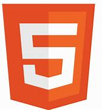
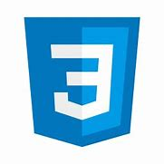
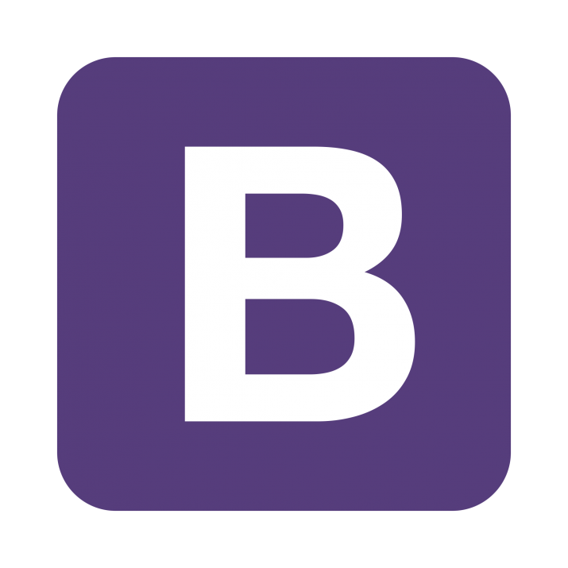
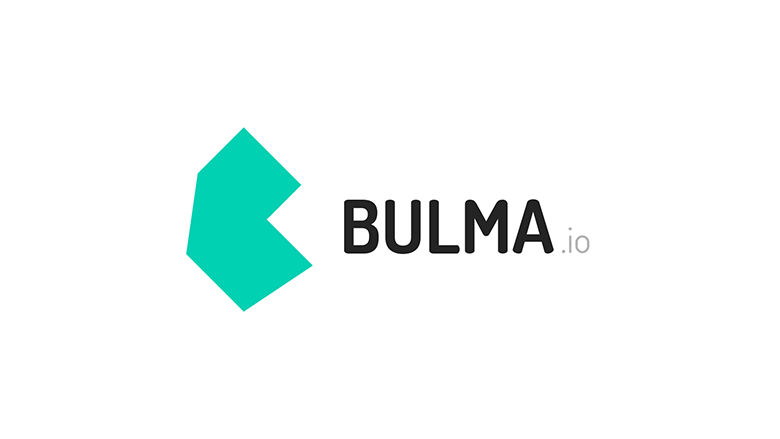
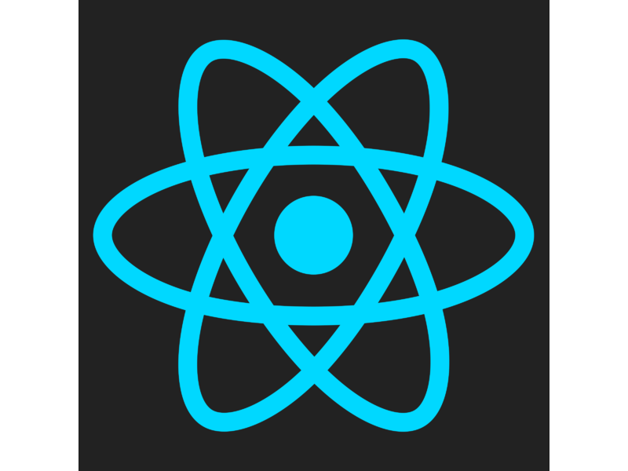
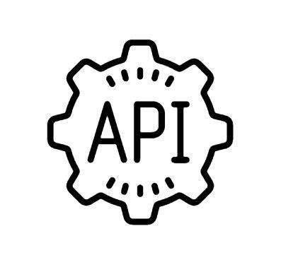
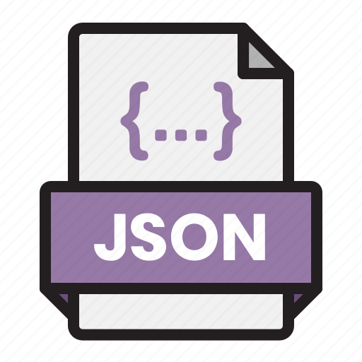
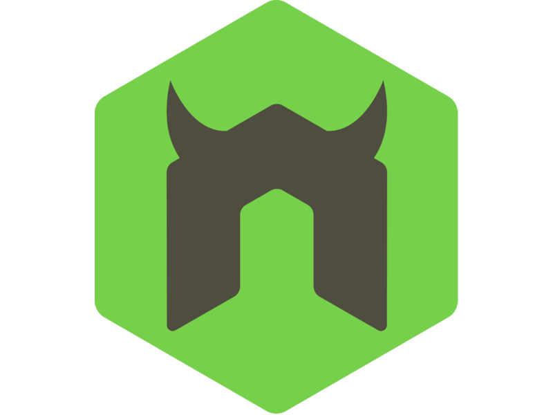
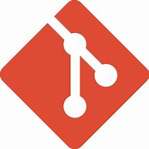
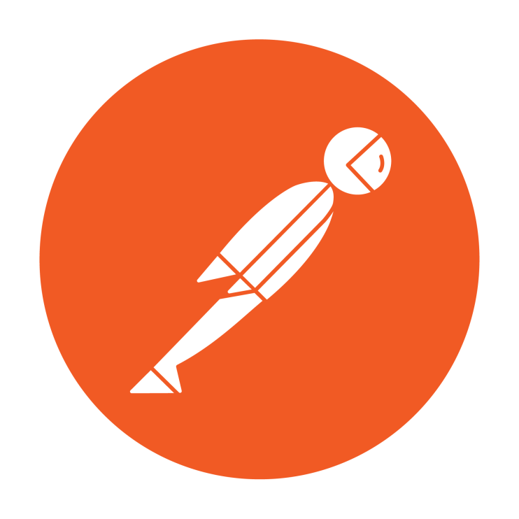

<h1>Hello world 👋🏾</h1>

<a class="badge-base__link LI-simple-link" href="https://www.linkedin.com/in/adegoke-fuad-ajibola-5a0034166/"> Adegoke Fuad Ajibola</a>

    
<h1>Welcome To ALIPHATIC'S Profile👽</h1>

###   **What's my current role in tech?** </h2>
       { fullStackDeveloper | Product Manager | Product Designer} 

#### Connect with me 

#### About
Here are some basic things to know about ALIPHATIC 👽👳🏾‍♂️;

- 🔭 I’m currently working on acquiring more skills,
- 🌱 I’m currently learning Fullstack Web Development,
- 👯 I’m looking to collaborate on projects,
<!--- 🤔 I’m looking for help with--> 
- 💬 Ask me about anything,
- 📫 How to reach me: Email: adegokefuad1@gmail.com, Phone: +2347053539948,
- 😄 Pronouns: He/Him/His,
- ⚡ Fun fact: I love Gaming.

#### My Core Languages
<code></code>
<code></code>
<code></code>
<code></code>

#### Frameworks I Use
<code></code>
<code></code>  
<code></code>
<code></code>
<code></code>
<code></code>
<code></code>

#### Tools I Use
<code></code>
<code></code>
<code></code>
<code></code>
<code></code>
<code></code>
<code></code>
<!-- <code></code> -->

  

       
#### Lifestyle

