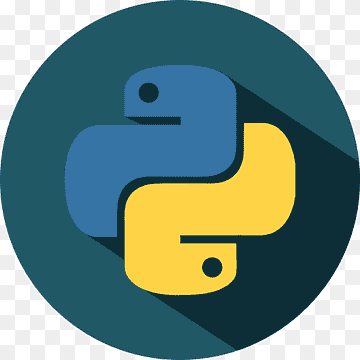
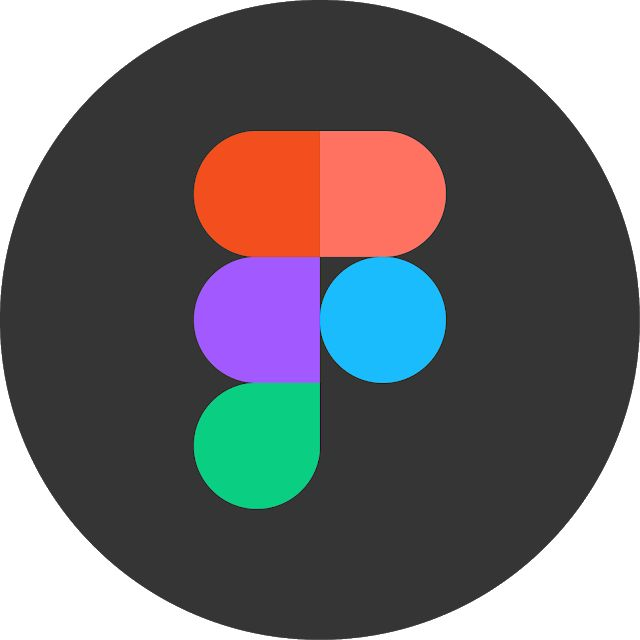

<h1>Hello World 👋🏾</h1>

<a class="badge-base__link LI-simple-link" href="https://substack.com/@aliphatic?r=1n1u2b&utm_campaign=profile&utm_medium=profile-page"> ALIPHATIC D. ‎فؤاد</a>

    
<h1>Welcome To ALIPHATIC'S Profile👽</h1>

###   **My current role in tech...** </h2>
       { Software Engineer || Community & Programs Manager } 

#### Connect with me 

#### About Me
Here are some basic things to know about ALIPHATIC: 👽

- 🔭 I’m currently exploring the Space Tech Ecosystem, 
- 🌱 I’m a Systems Engineering Major,
- 👯 I’m looking for people to join the communities I'm building.
- 🤔 I can help you with getting into open-source,
- 💬 Ask me about anything, 🌚
- 📫 How to reach me; Email: adegokefuad1@gmail.com, Phone: +2348133363313,
- 😄 Pronouns: He/Him/His,
- ⚡ Fun fact: I love Gaming, Swimming, & Writing.
  
 

#### My Core Languages

<code></code>
<code></code>
<code></code>
<!--
<code></code>
<code></code>
--> 
<!--
#### Frameworks/Libraries I Use
<code></code>
<code></code>
<code></code>
<code></code>
<code></code>
<code></code>  
<code></code>
 <code></code> -->

<!--
<code></code>
<code></code>
<code></code>
<code></code>
<code></code>
<code></code>

<!--#### Tools I Use
<code></code>
<code></code>
<code></code>
<code></code>
<code></code>
<code></code>
<code></code>
<!-- <code></code> -->
<!--<code></code>
<code></code>
<code></code>
<code></code> -->
