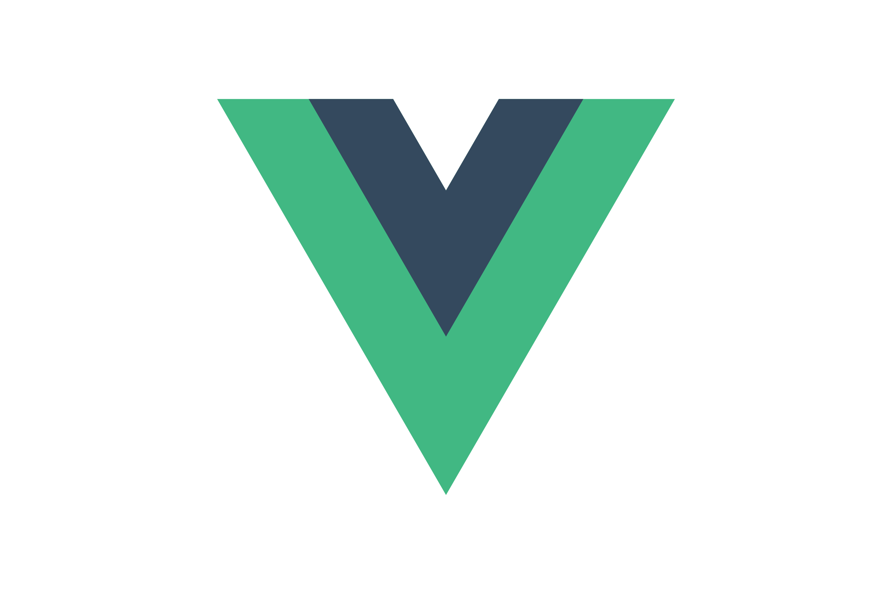

Hi there 👋🏾

<a class="badge-base__link LI-simple-link" href="https://ng.linkedin.com/in/fuad-ajibola-5a0034166?trk=profile-badge">Fuad Ajibola</a>

              
Welcome To ALIPHATIC'S Profile😀

#### Connect with me 

#### About
Here are some basic things to know about ALIPHATIC 👽👳🏾‍♂️;

- 🔭 I’m currently working on acquiring more skills,
- 🌱 I’m currently learning Fullstack Web Development,
- 👯 I’m looking to collaborate on projects,
<!--- 🤔 I’m looking for help with--> 
- 💬 Ask me about anything,
- 📫 How to reach me: Email: adegokefuad1@gmail.com, Phone: +2347053539948,
- 😄 Pronouns: He/Him/His,
- ⚡ Fun fact: I love Gaming.

#### Core Languages
<code></code>
<code></code>
<code></code>
<code></code>

#### Frameworks
<code></code>
<code></code>
<code></code>
<code></code>
<code></code>
<code></code>
<code></code>
<code></code>

#### Tools
<code></code>
<code></code>
<code></code>
<code></code>
<code></code>

#### Lifestyle

